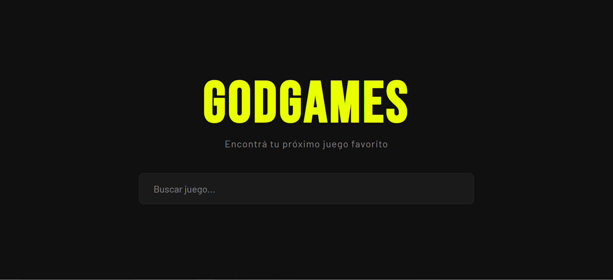
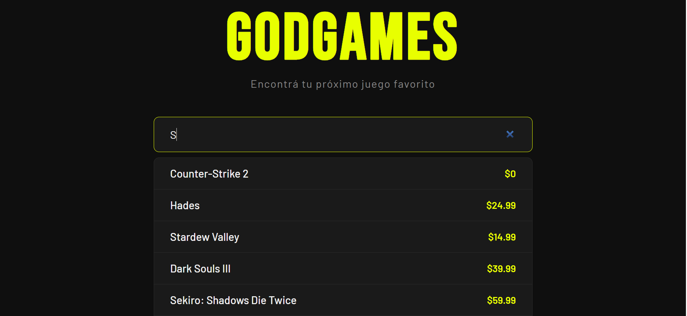
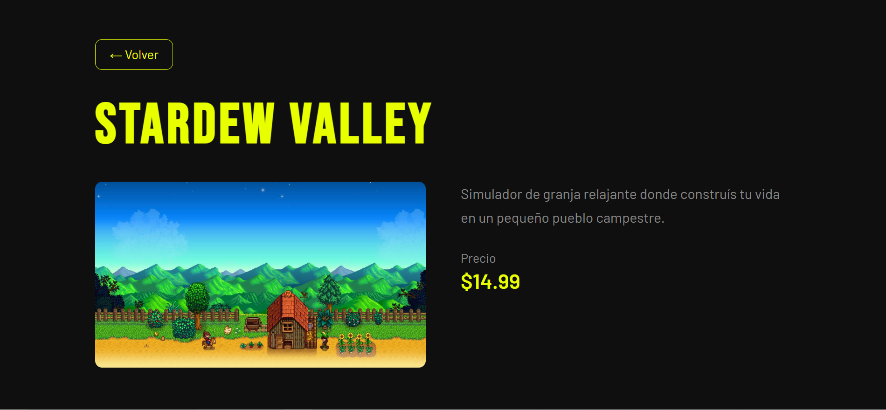
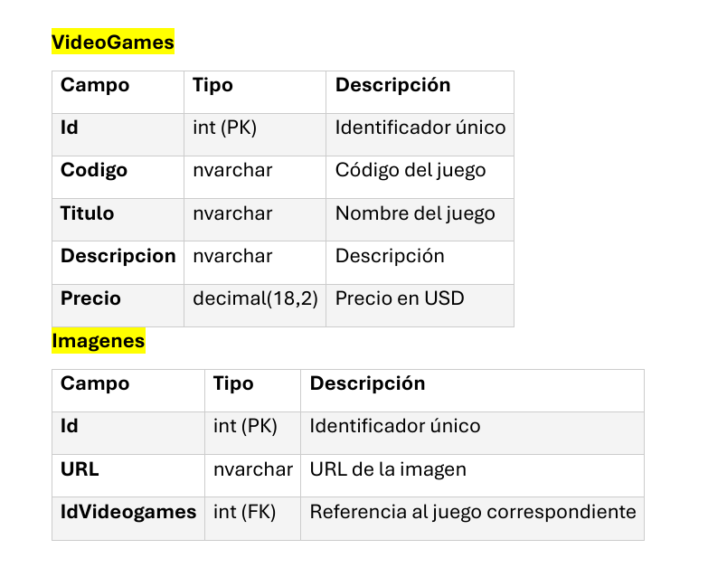

# Buscador-de-Videojuegos

# Buscador de Videojuegos 🎮
Bienvenid@s a mi primer proyecto FullStack. 
Catálogo de videojuegos con buscador en tiempo real. Permite buscar juegos, ver sus detalles, precio e imagen. Construido con ASP.NET Core en el backend y React en el frontend. 

## Tecnologías

**Backend**
- ASP.NET Core Web API (.NET 9)
- Entity Framework Core
- SQL Server

**Frontend**
- React + Vite
- React Router DOM
- Axios
- CSS personalizado (sin frameworks)

## Estructura del proyecto
GodGames/
├── Controllers/
│   └── VideoGameController.cs   # Endpoints REST
├── Data/
│   └── AppDbContext.cs           # Contexto de base de datos
├── Models/
│   ├── VideoGames.cs             # Modelo juego
│   └── Imagen.cs                 # Modelo imagen
├── Migrations/                   # Migraciones EF Core
├── appsettings.json              # Configuración y connection string
└── Program.cs                    # Entry point

frontend/
├── src/
│   ├── pages/
│   │   ├── Home.jsx              # Página principal con buscador
│   │   ├── GameDetail.jsx        # Detalle del juego
│   │   └── SearchFilter.jsx      # Componente de búsqueda
│   ├── services/
│   │   └── gameServices.js       # Llamadas a la API
│   ├── main.jsx                  # Entry point React
│   └── styles.css                # Estilos globales

## Base de datos
El modelo utiliza dos tablas: 

## Ejemplo para POST/PUT
{
  "codigo": "G001",
  "titulo": "League of Legends",
  "descripcion": "Jueguito re lindo que pone a prueba tu paciencia",
  "precio": 0,
  "imagenes": [
    {
      "url": "https://urldelaimagen.jpg",
      "idVideogames": 0
    }
  ]
}

## Funcionalidades
- Búsqueda de juegos en tiempo real por título
- Página de detalle con imagen, descripción y precio
- Diseño responsive para mobile y desktop
- UI oscura con tipografía personalizada (Bebas Neue + Barlow)

## Próximas mejoras
-Panel de administración para agregar, editar y eliminar juegos
-Migración a Supabase (PostgreSQL)
-Integración con la API de RAWG para imágenes automáticas
-Paginación en los resultados
-Filtro por precio y categoría